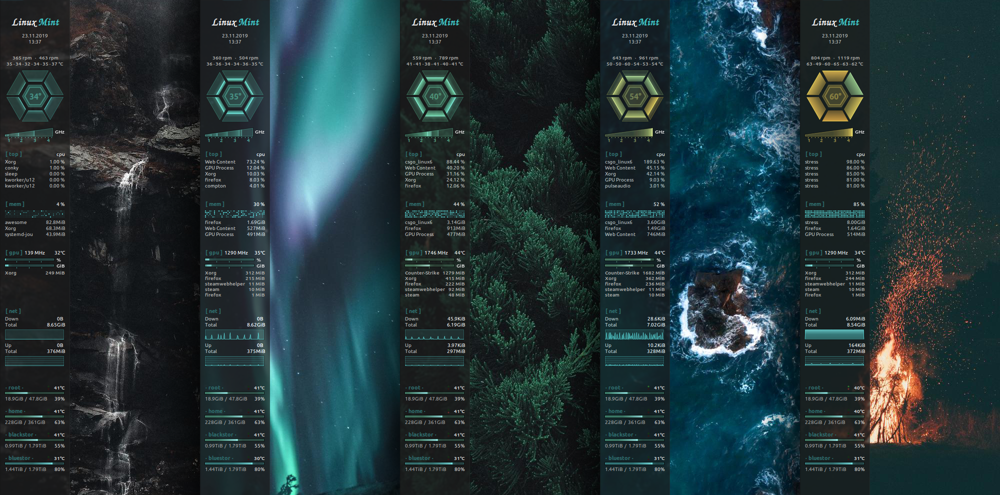

# polycore

**A conky config and library of Lua widgets**

## Widgets

**See [philer.github.io/polycore](https://philer.github.io/polycore) for a full API reference.**

The `widget` module provides a number of basic and specialized modules
as well as grouping and rendering facilities. Their basic usage is best
understood by inspecting the `setup` and `update` functions in the main `polycore` module.

Widgets will be rendered by a `WidgetRenderer` instance and can have a cached background. A `WidgetGroup` instance can serve as root of a complex layout of nested widgets. All widgets are rendered in a vertical stack. The width is defined by the `WidgetRenderer` while the height is chosen by each widget.
It makes sense to combine this with normal conky text rendering - in fact some Widgets (e.g. `Network` and `Drive`) assume this.

In order to add your own Widget you should inherit the base class (`util.class(Widget)`). Look at `widget.lua` for examples as well as the base class with documentation of the relevant methods `:layout(width)`, `:render_background(cr)`, `:update()` and `:render(cr)`.

The following Widget classes are currently available:

* **`Widget`** the base class - Does nothing by itself.
* **`WidgetGroup`** a container for multiple widgets to be rendered in a vertical stack - It is useful to subclass this in order to create compound widgets with a combined `:update()`.
* **`Gap`** Leave some empty vertical space.
* **`Bar`** a basic bar similar to the one available in normal conky.
* **`Graph`** a basic graph similar to the one available in normal conky.
* **`TextLine`** Display a dynamic line of text
* **`Cpu`** CPU-Usage indiciator in the form of a Polygon one segment per core - You guessed it, that's how this theme got its name.
* **`CpuFrequencies`** Bar-like indicator of frequencies for individual cores
* **`MemoryGrid`** visualization of used (and buffered/cached) RAM in a randomized grid
* **`Gpu`** Bars for GPU and VRAM usage - requires `nvidia-smi`
* **`Network`** Graphs for up- and download speed
* **`Drive`** Bar plus temperature indicator for a hard drive - requires hddtemp to be running and sudo access to nvme-cli for experimental NVME SSD support.

